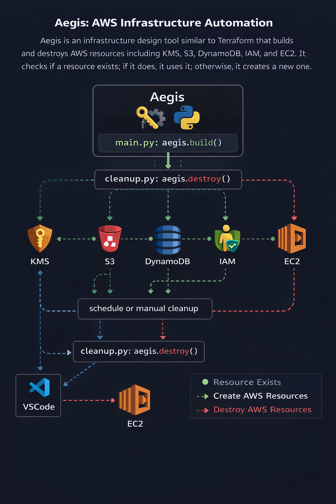

# Aegis AWS Infrastructure Automation Tool

[](https://github.com/emredogan-cloud/aegis/actions/workflows/main.yaml)

## Architecture Diagram



Aegis is a production-grade AWS infrastructure automation tool written in Python using Boto3.  
It provisions and destroys AWS resources in an idempotent, secure, and modular way.

This project is designed as a Terraform-like automation pipeline using pure Python.

**Containerized with Docker** — Run Aegis in isolated, reproducible environments with built-in AWS credential handling and security best practices.

---

## 🚀 Features

- **Idempotent provisioning and cleanup** — Safe, repeatable operations
- **Modular service architecture** — Clean separation of concerns
- **Least-privilege IAM policy generation** — Security-first design
- **KMS alias-based key lifecycle management** — Automated encryption
- **EC2 instance reuse via tag-based discovery** — Cost-efficient resource handling
- **Centralized waiter abstraction layer** — Reliable state synchronization
- **Full infrastructure lifecycle management** — Provision and destroy in one tool
- **Production-grade logging** — Detailed operational insights
- **Terraform-like apply / destroy behavior** — Familiar workflow
- **Docker containerization** — Reproducible, isolated execution environments
- **AWS credential handling** — Secure volume mount or environment variable support

---

## 🧱 Architecture

```
main.py                  → Provision orchestrator
cleanup.py              → Destroy orchestrator

services/               → AWS service lifecycle logic
clients/                → Boto3 client factories
utils/                  → Logger and waiters
data/                   → IAM policy builders
config.py               → Central configuration

Dockerfile              → Multi-stage container build
docker-compose.yml      → Orchestration & environment config
DOCKER.md               → Containerization guide
```


---

## 🔁 Provision Flow

`python main.py` performs:

1. Create or reuse KMS master key (alias controlled)
2. Create S3 bucket
3. Create DynamoDB audit table
4. Create IAM role, policy, and instance profile
5. Provision EC2 instance (tag-based idempotent)
6. Return public IP of the worker instance

---

## 🧹 Cleanup Flow

`python cleanup.py` performs:

1. Terminate EC2 instances
2. Delete security group
3. Delete key pair
4. Remove IAM profile, policy and role
5. Delete DynamoDB table
6. Empty and delete S3 bucket
7. Remove KMS alias and schedule key deletion

This mirrors Terraform destroy behavior.

---

## 🔐 Security Design

### Application-Level

- **KMS symmetric encryption** with alias lifecycle
- **IAM least-privilege policy builder** — minimal permissions granted
- **Instance profile based permissions** — EC2-to-AWS auth without keys
- **No hard-coded credentials** — environment or volume-based only
- **SSH restricted by CIDR** — network-level access control
- **Audit-ready DynamoDB table** — track all infrastructure changes

### Container-Level (Docker)

- **Non-root user execution** (`aegis:1000`) — prevents privilege escalation
- **Read-only AWS volume mount** — credentials cannot be modified
- **Multi-stage build** — reduces image size and attack surface
- **Health checks** — validates AWS SDK readiness
- **Resource limits** — CPU/memory constraints (docker-compose)
- **No secrets in Dockerfile** — use environment or volume mounts only

---

## ⚙️ Configuration

### Application Config (`config.py`)

All infrastructure parameters are defined in `config.py`:

```python
AWS_REGION = "us-east-1"
AWS_ACCOUNT_ID = "107282186532"

S3_BUCKET_NAME = "boto3-bucket6478324"
DYNAMODB_TABLE_NAME = "Aegis_Audit_Log"

IAM_ROLE_NAME = "Aegis_Role_v1"
IAM_INSTANCE_PROFILE_NAME = "Aegis_Worker_Profile"

EC2_KEY_PAIR_NAME = "Aegis_Key"
EC2_SECURITY_GROUP_NAME = "Aegis_SG"

SSH_ALLOWED_CIDR = "192.168.1.107/32"

KMS_ALIAS_NAME = "alias/aegis-master-key"
DYNAMODB_BILLING_MODE = 'PAY_PER_REQUEST'
```

### Docker Environment Variables

For containerized execution, pass AWS credentials via environment or volume:

```bash
# Option 1: Environment Variables
-e AWS_REGION=us-east-1
-e AWS_ACCESS_KEY_ID=<key>
-e AWS_SECRET_ACCESS_KEY=<secret>

# Option 2: Volume Mount (Recommended)
-v ~/.aws:/home/aegis/.aws:ro

# Option 3: Custom config.py
-v $(pwd)/config.py:/app/config.py:ro
```


## ▶️ Usage

### Local (Python)

```bash
# Provision infrastructure
python main.py

# Destroy infrastructure
python cleanup.py
```

### Docker (Recommended)

#### Build the Image

```bash
docker build -t aegis:latest .
```

#### Provision with AWS Credentials from Host

```bash
docker run -v ~/.aws:/home/aegis/.aws:ro aegis:latest
```

#### Provision with Environment Variables

```bash
docker run \
  -e AWS_REGION=us-east-1 \
  -e AWS_ACCESS_KEY_ID=<your-key> \
  -e AWS_SECRET_ACCESS_KEY=<your-secret> \
  aegis:latest
```

#### Docker Compose (Production-Ready)

```bash
# Set credentials
export AWS_ACCESS_KEY_ID=<your-key>
export AWS_SECRET_ACCESS_KEY=<your-secret>

# Provision
docker-compose up

# Cleanup
docker-compose run aegis python cleanup.py
```

#### Interactive Shell

```bash
docker run -it -v ~/.aws:/home/aegis/.aws:ro aegis:latest /bin/bash
```

For detailed Docker documentation, see [DOCKER.md](./DOCKER.md).

## 📦 Requirements & Installation

### Local Setup

```bash
# Install dependencies
pip install -r requirements.txt

# Configure AWS credentials
aws configure
```

### Docker Setup

```bash
# Build image
docker build -t aegis:latest .

# Verify Docker and AWS SDK
docker run aegis:latest python -c "import boto3; print('Ready!')"
```


## 🧠 Design Principles

- **Idempotency first** — Safe to re-run without side effects
- **Separation of concerns** — Modular service architecture
- **Explicit orchestration** — No magic; clear control flow
- **Infrastructure lifecycle ownership** — One tool, provision to destroy
- **Cloud-native security design** — Least-privilege, audit trails, KMS encryption
- **Production-ready logging** — Detailed, timestamped operations
- **Container-native** — Reproducible builds, no environment surprises
- **Infrastructure-as-Code principles** — Declarative, version-controlled setup


## 🚀 Quick Start

### Clone the Repository

```bash
git clone https://github.com/emredogan-cloud/aegis.git
cd aegis
```

### Option 1: Run Locally

```bash
# Create virtual environment
python -m venv venv
source venv/bin/activate  # On Windows: venv\Scripts\activate

# Install dependencies
pip install -r requirements.txt

# Configure AWS
aws configure

# Provision infrastructure
python main.py

# Later, destroy
python cleanup.py
```

### Option 2: Run in Docker (Recommended)

```bash
# Build
docker build -t aegis:latest .

# Provision
docker run -v ~/.aws:/home/aegis/.aws:ro aegis:latest

# Or use Docker Compose
docker-compose up

# Cleanup
docker run -v ~/.aws:/home/aegis/.aws:ro aegis:latest python cleanup.py
```

For detailed Docker documentation, see [DOCKER.md](./DOCKER.md).

## 🐛 Troubleshooting

### AWS Credential Issues

```bash
# Verify credentials are configured
aws sts get-caller-identity

# For Docker, mount read-only
docker run -v ~/.aws:/home/aegis/.aws:ro aegis:latest
```

### KMS Key Errors

```bash
# List KMS keys
aws kms list-keys --region us-east-1

# Check alias
aws kms list-aliases --region us-east-1 | grep aegis
```

### Check Container Logs

```bash
docker logs <container-id>
```

### Run Interactive Shell

```bash
docker run -it -v ~/.aws:/home/aegis/.aws:ro aegis:latest /bin/bash
```

## 🚢 Deployment

### Local Production

```bash
# Non-interactive provision
python main.py > provision.log 2>&1

# Store IPs for later
grep "Public IP" provision.log
```

### Kubernetes (Optional)

Create a Kubernetes Job with the Aegis image for automated infrastructure provisioning:

```yaml
apiVersion: batch/v1
kind: Job
metadata:
  name: aegis-provisioner
spec:
  template:
    spec:
      containers:
      - name: aegis
        image: aegis:latest
        env:
        - name: AWS_REGION
          value: "us-east-1"
        volumeMounts:
        - name: aws-credentials
          mountPath: /home/aegis/.aws
          readOnly: true
      volumes:
      - name: aws-credentials
        secret:
          secretName: aws-credentials
      restartPolicy: Never
```

### GitHub Actions CI/CD

```yaml
name: Aegis Provision

on:
  push:
    branches: [main]

jobs:
  provision:
    runs-on: ubuntu-latest
    steps:
      - uses: actions/checkout@v4
      
      - name: Configure AWS credentials
        uses: aws-actions/configure-aws-credentials@v4
        with:
          aws-access-key-id: ${{ secrets.AWS_ACCESS_KEY_ID }}
          aws-secret-access-key: ${{ secrets.AWS_SECRET_ACCESS_KEY }}
          aws-region: us-east-1
      
      - name: Build Aegis Docker image
        run: docker build -t aegis:latest .
      
      - name: Provision infrastructure
        run: docker run -v ~/.aws:/home/aegis/.aws:ro aegis:latest
```

## 📊 Project Files

```
aegis/
├── main.py                 # Provision orchestrator
├── cleanup.py              # Destroy orchestrator
├── config.py               # Central configuration
├── requirements.txt        # Python dependencies
├── Dockerfile              # Docker multi-stage build
├── docker-compose.yml      # Docker Compose config
├── .dockerignore            # Docker build optimization
├── DOCKER.md               # Docker documentation
├── README.md               # This file
├── LICENSE                 # MIT License
├── services/               # AWS service modules
│   ├── kms_service.py
│   ├── s3_service.py
│   ├── dynamodb_service.py
│   ├── iam_service.py
│   └── ec2_service.py
├── clients/                # Boto3 client factories
├── utils/                  # Logger and waiters
└── data/                   # IAM policy builders
```

## 📜 License

MIT License - See [LICENSE](./LICENSE) for details.
